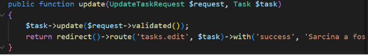

**№1. Pregătirea lucrării**

1. **Crearea unui proiect nou Laravel**:
   1. Comandă: laravel new task-manager sau composer create-project laravel/laravel task-manager.
1. **Configurarea fișierului .env**:

   
#### **№2. Crearea formularului**
1. **Crearea formularului HTML cu șabloane Blade**:
   1. Vizualizare: resources/views/tasks/create.blade.php

**Controllerul TaskController**:

**Crearea rutei**:

- În routes/web.php

  
#### **№3. Validarea datelor pe partea de server**
Validarea este implementată în metoda store, cu reguli specifice pentru fiecare câmp.

**1. Metoda store cu validare directă**

#### **2. Afișarea erorilor de validare în formular**
În fișierul Blade unde se află formularul (resources/views/tasks/create.blade.php)

#### **№4. Crearea unei clase de cerere personalizată**
1. **Crearea clasei CreateTaskRequest**:
   1. Comandă: php artisan make:request CreateTaskRequest.
1. **Definirea regulilor în CreateTaskRequest**:

1. **Actualizarea metodei store**:

#### **№5. Adăugarea mesajelor flash**
- În create.blade.php

####
####
#### **№6. Protecția împotriva CSRF**
Directiva @csrf este deja adăugată în formularul HTML.

#### **№7. Actualizarea sarcinii**
1. **Crearea metodei edit**:

1. **Crearea metodei update**:

1. **Rutele pentru editare**:

1. #### ` `**Formular pentru editare**
Creați resources/views/tasks/edit.blade.php

**Întrebări de control**

1. **Ce este validarea datelor?** Este procesul de verificare a corectitudinii și conformității datelor primite de la utilizator pentru a preveni erori și vulnerabilități.
1. **Cum se protejează formularele împotriva CSRF?** Laravel folosește token-uri unice (@csrf) pentru fiecare sesiune, prevenind cererile neautorizate.
1. **Cum se creează clase de cerere personalizată?** Se folosește comanda Artisan php artisan make:request NumeRequest. Regulile și mesajele sunt definite în metodele rules și messages.
1. **Cum se protejează datele împotriva atacurilor XSS?** Laravel scapează automat datele afișate în vizualizări folosind directiva {{ $variable }} pentru a preveni injecțiile de cod malițios.

